### P初值的设置

如果值设置的比较大的话，可以让卡尔曼滤波知道自己的模型不确定性比较大。

上面的理解存在问题，P存在的意义是估量当我们一开始初始化状态值的时候，根据我们认为自己的初始化估计可能在数值上会有多少上下浮动，设置出来的值。

对于置信区间的理解，就是方差，要用==正确的过程噪声方差==，才能使更多的真实值落在置信区间中。

### Q矩阵的存在

为什么会有Q矩阵的存在，因为测量出来的速度可能存在不确定性，且我们估计的随机变量，所以在进行状态转移（预测）过程中，不仅要对状态量的方差进行转移，同时也要加上校正后的状态量的速度方不确定性，这个通常是自己定义的，毕竟不同情况下，车的不确定性是不一样的。

> For maneuvering targets, like airplanes, the σ2 a should be relatively high.
> For non-maneuvering targets, like rockets, you can use smaller σ2a.

第一句话的意思是机动目标的话，比如汽车和飞机这些，由于人为原因，经常会出现转弯，刹车这些操作，加速度老是变化，==模型难以准确预测这些变化==，所以加速度方差应该设置大一些

第二句话是非机动目标，一旦进入飞行轨道后，速度方向几乎固定，运动很平滑，==模型很准==，所以方差就可以小一些 

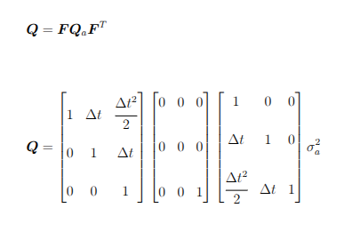

### 卡尔曼滤波出现滞后误差可能的原因

#### 估计加热液体的温度

- 模型存在错误，在状态转移的时候，直接拿上一时刻的最优估计作为当前时刻的先验估计
- 选择了错误的过程噪声，比如Q的数值过低

### 线性动力系统建模

### 线性系统

> A linear system follows two basic rules:
> 1. You can “factor out” constant multiplicative scale factors (the a and b above).
> 2. The system’s response to a sum of inputs is the sum of the responses to each
> input separately

1. 第一点就是有常数比例缩放因子，比如A或者F矩阵这些是常数
2. 系统具备可加性，当向系统输入(x~1~+x~2~)的时候，S(x~1~+x~2~) = S(x~1~)+S(x~2~) 

### 线性时不变系统

这个概念不是很理解，虽然意思懂一些，就是无论你输入什么时刻的变量，过程的处理是一样的

比如简单滤波：$y[n]=13(x[n]+x[n−1]+x[n−2])y[n] = \tfrac{1}{3}(x[n]+x[n-1]+x[n-2])y[n]=31(x[n]+x[n−1]+x[n−2])$。不管何时输入信号，系统对时间的处理方式不变。

### UKF

[正定矩阵和半正定矩阵的讲解](https://www.zhihu.com/tardis/zm/art/44860862?source_id=1005)

在卡尔曼滤波中，必须保证P矩阵的对角线大于等于0,也就是保证状态量的方差大于或等于0

还有要保证$z^tPz$>=0,为什么要保证这个$z^tPz$>=0呢？因为这个玩意是随机变量$y = z^tx$,(x也是随机变量,z是一个常量)

也就是意味着P矩阵必须是半正定矩阵（包含正定矩阵），因为这两个矩阵的定义就是$z^tPz$>=0;

那怎么保证这个玩意是半正定矩阵呢？
可以用$P = S^tS$这样的数学形式来保证P是正定和半正定矩阵，这个S就可以用Cholesky来求解。

具体的使用方式：

1. **初始化**：将初始协方差 P0 进行 Cholesky 分解，得到 S0（通常取为下三角因子 L0*L*0）。
2. **预测步与更新步**：设计一套针对 S*S* 的更新公式（涉及正交变换、QR分解等），确保每一步得到的 Sk 都是实数矩阵，且满足 Pk=SkSk^T^。这些公式通常避免直接相减，从而保持数值稳定性。
3. **需要显式计算 P 时**：若需要输出协方差矩阵，只需计算 SST，这个乘法运算不会破坏正定性。

#### 运行流程

**预测阶段**

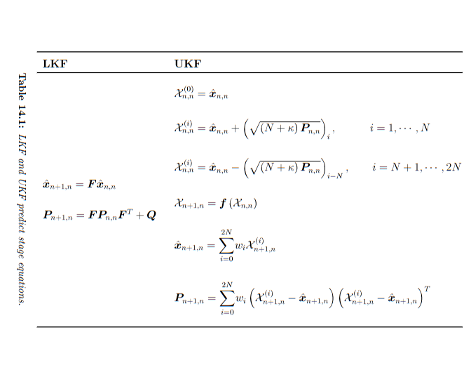

**更新阶段**:

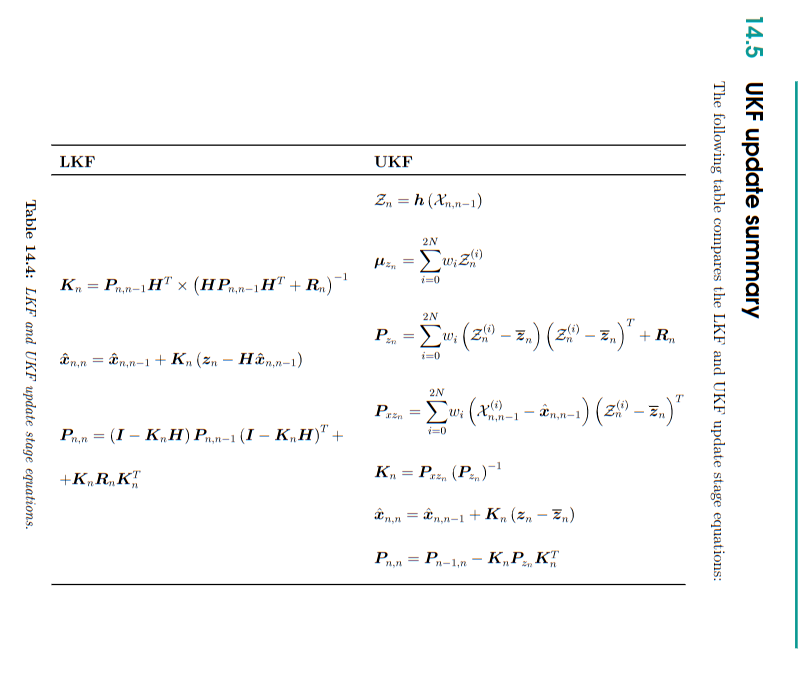

总的运行流程如下：

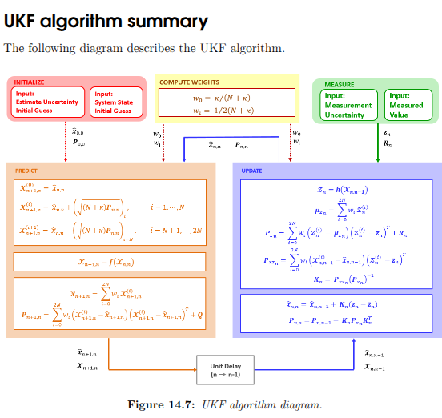

### EKF

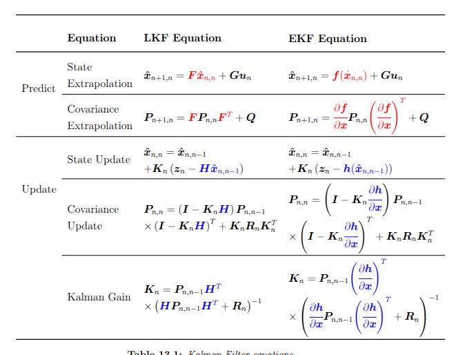

如果F矩阵不是像匀速模型或者匀加速模型那种，1……dt……1/2dt^2^,而是像下面这种公式，有着sin,cos或者指数函数

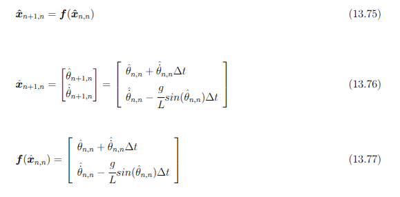

这种明显就是非线性方程，直接把上一次的最优估计值输入到矩阵中，直接算出预测值

对于求协方差矩阵的F矩阵，就是F矩阵对状态量x求偏导，如下格式

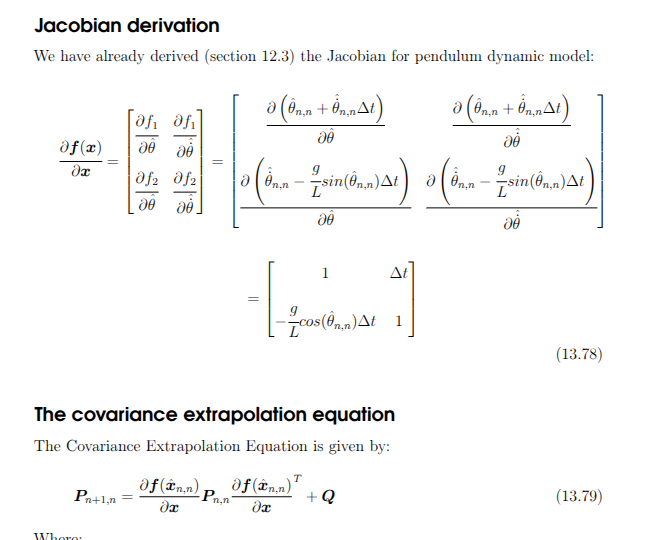

用上述方程更新协方差矩阵，在我看数值示例的时候，每次协方差更新，对角的值（状态向量的方差）都会上升，非对角的值(协方差)也会上升。这也就意味着，==每次进行模型预测，都会引入新的噪声==。

接着，我们需要用测量方程来测量值，然后进行数据融合，数据融合这个过程就是卡尔曼滤波的核心方程，最优状态估计

然后由于状态向量要转换到测量向量，这个过程也可能是非线性过程，这个时候==就需要对H矩阵对状态量求偏导进行线性化==，同样是把状态量输入到H函数中
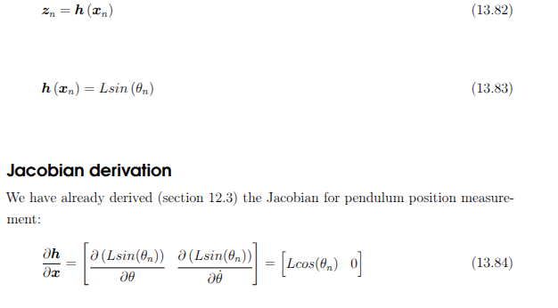

后面就是用雅可比矩阵代替原本的那些矩阵，去求卡尔曼增益和状态更新那些

下面是协方差更新方程和状态更新方程

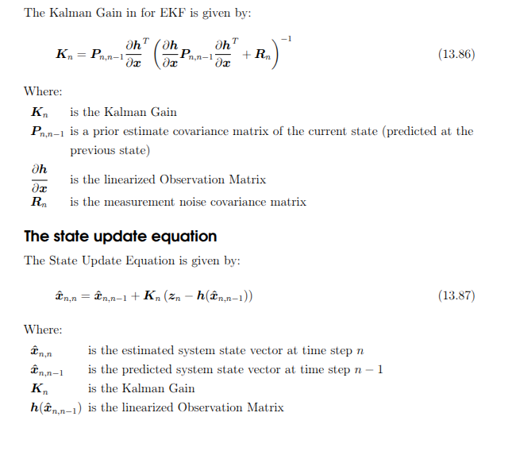

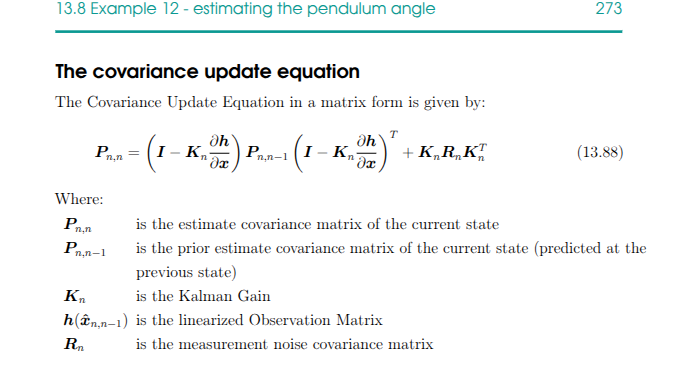

> The EKF linearized covariance includes a high linearization error.

**EKF的缺陷**：据作者所言，EKF在非线性化程度不高的情况下表现良好，在高度非线性化的情况下，有较高的线性误差。

[为何协方差是椭圆](https://blog.csdn.net/flyfish1986/article/details/139813051#:~:text=%E6%A4%AD%E5%9C%86%20%EF%BC%9A%E9%80%9A%E8%BF%87%E5%8D%8F%E6%96%B9%E5%B7%AE%E7%9F%A9%E9%98%B5%E7%9A%84%E7%89%B9%E5%BE%81%E5%90%91%E9%87%8F%E5%92%8C%E7%89%B9%E5%BE%81%E5%80%BC%E5%8F%98%E6%8D%A2%E5%BE%97%E5%88%B0%E7%9A%84%E6%A4%AD%E5%9C%86%EF%BC%8C%E8%A1%A8%E7%A4%BA%E6%95%B0%E6%8D%AE%E5%9C%A8%E6%96%B0%E7%9A%84%E5%9D%90%E6%A0%87%E7%B3%BB%E4%B8%8B%E7%9A%84%E5%88%86%E5%B8%83%E3%80%82%20%E7%89%B9%E5%BE%81%E5%90%91%E9%87%8F%20%EF%BC%9A%E7%BA%A2%E8%89%B2%E7%AE%AD%E5%A4%B4%E8%A1%A8%E7%A4%BA%E7%89%B9%E5%BE%81%E5%90%91%E9%87%8F%E6%96%B9%E5%90%91%EF%BC%8C%E5%8D%B3%E6%A4%AD%E5%9C%86%E7%9A%84%E4%B8%BB%E8%A6%81%E8%BD%B4%E6%96%B9%E5%90%91%E3%80%82%20%E7%89%B9%E5%BE%81%E5%80%BC%20%EF%BC%9A%E7%BA%A2%E8%89%B2%E7%AE%AD%E5%A4%B4%E7%9A%84%E9%95%BF%E5%BA%A6%E8%A1%A8%E7%A4%BA%E7%89%B9%E5%BE%81%E5%80%BC%E5%A4%A7%E5%B0%8F%EF%BC%8C%E5%8D%B3%E6%A4%AD%E5%9C%86%E6%B2%BF%E4%B8%BB%E8%A6%81%E8%BD%B4%E7%9A%84%E4%BC%B8%E7%BC%A9%E7%A8%8B%E5%BA%A6%E3%80%82%20import%20matplotlib.pyplot,%23%20%E7%A4%BA%E4%BE%8B%E5%8D%8F%E6%96%B9%E5%B7%AE%E7%9F%A9%E9%98%B5%20%23%20%E7%BB%98%E5%88%B6%E5%8D%95%E4%BD%8D%E5%9C%86%E5%92%8C%E6%A4%AD%E5%9C%86%20eigval%20%3D%20np.sqrt%28eigenvalues%5Bi%5D%29%20)

还有最后一个图 ，就是反映出UKF比EKF更适合非线性化程度比较高的情况，EKF线性化的协方差往往较低，与实际协方差差的较大，对自己的模型过于信任

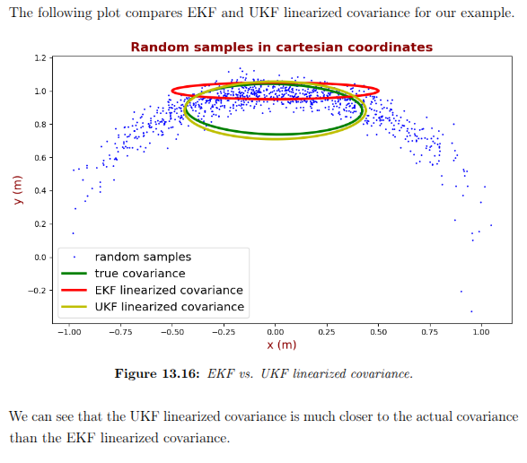

