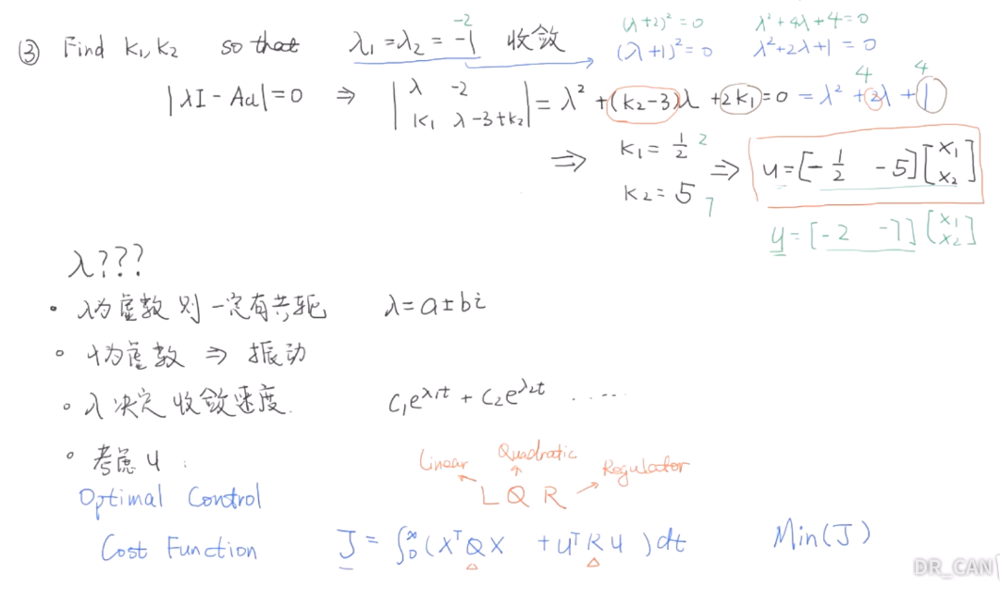
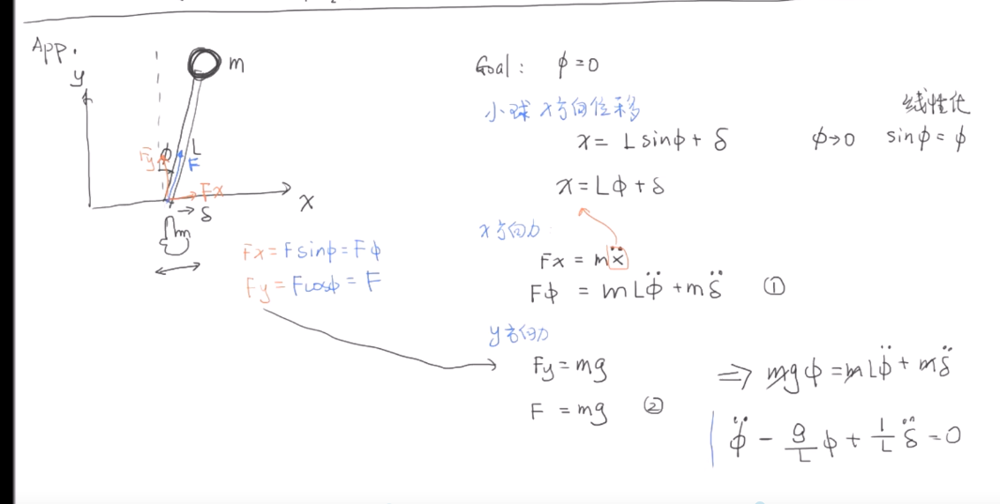
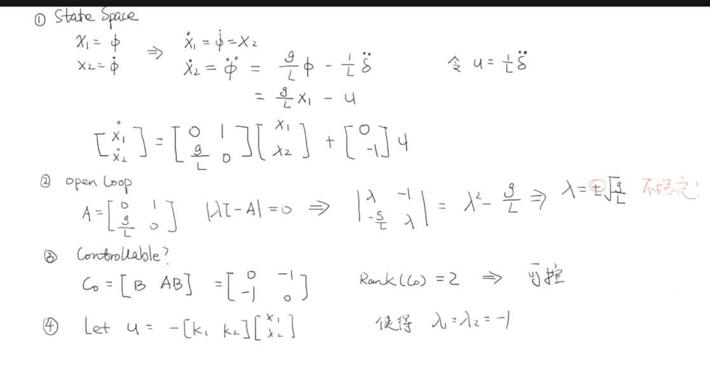
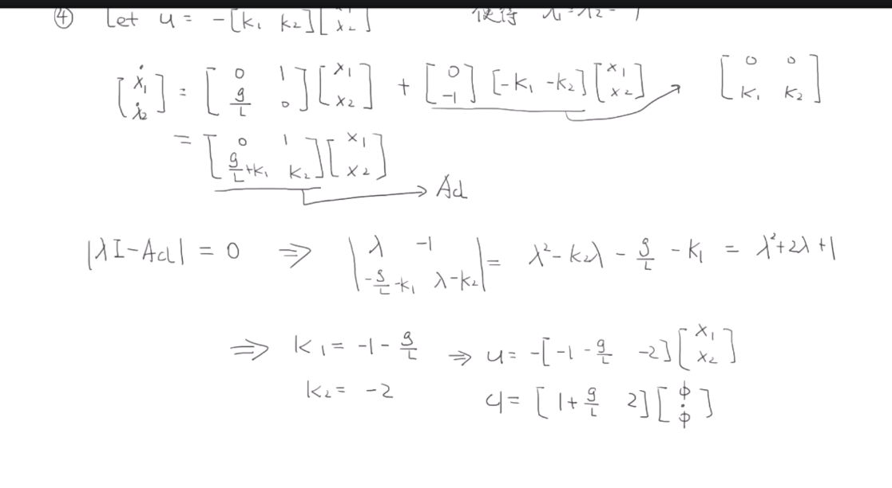

## MPC理论

### 前置知识

#### 线性控制器设计

==开环系统==

$$\dot{X} = AX$$,这个时候要确保A矩阵的特征值$\lambda$<0，确保系统稳定

==闭环系统==

$$\dot{X} = AX + Bu$$,**先可控再确保稳定性**

确保可控，用$\begin{bmatrix} B & AB \end{bmatrix}$这个矩阵的秩是满秩

稳定性：跟上面一样，确保A矩阵的特征值$\lambda$<0。

在实际应用中，我们需要**先确保可控性**，即上面的公式。

我们会设计**u = $\begin{bmatrix} -k_1 & -k_2 \end{bmatrix}$X**,然后乘以B矩阵，设$\lambda$=-1,然后用**求解特征值的公式**去算k1和k2，使得行列式成立

我们可以通过**选择K的值来改变A~cl~的特征值，进而控制系统表现**

下图的A~cl~矩阵是$A-BK$.

如上图，$\lambda$不一定是-1,可以根据实际情况选取，如果要收敛速度快的话，那么就减小$\lambda$的值，但是与此同时，输入的矩阵数值也会变大。

所以要综合考虑。下面的代价函数是LQR公式，如果看重收敛速度，就在Q做文章，看重输入的值的话，就在R做文章。

==实际应用==

### 内容部分 

