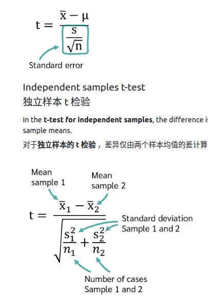
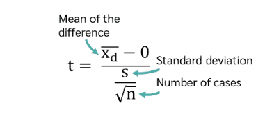
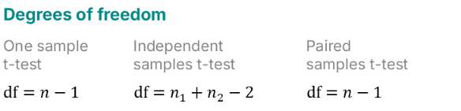
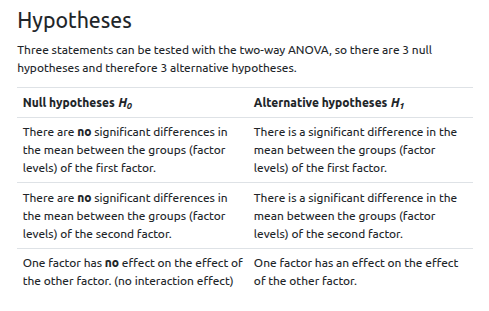
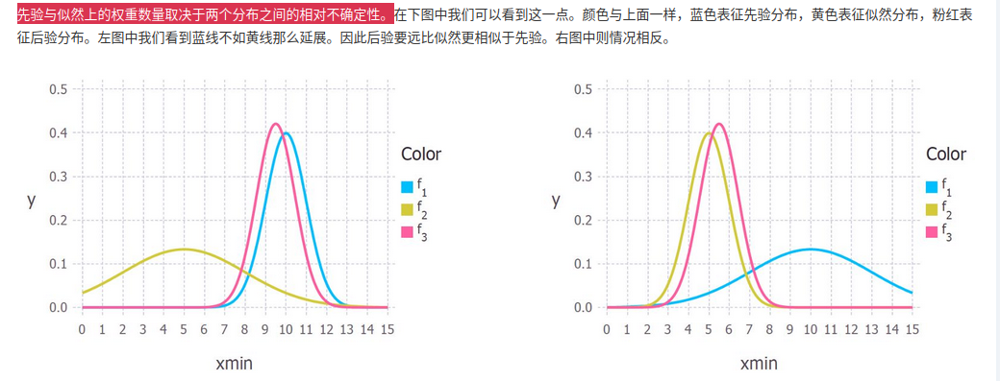

# 求求你了 ZKJ 认真做笔记

## 两种统计
描述性统计**描述样本**,推断性统计从样本推断出**总体**
### 描述性统计
1. 中心点的趋势
   1. 平均数 **对离群值没有抵抗性**，一旦有数值相当大的时候，平均值会受影响。就比如小学生一个班的平均身高是140,但是突然来了个200cm的人，那平均值肯定会变化
   2. 中位数 **对离群值具备抵抗性**
   3. 众数(mode 出现次数最多的数)
2. 分散度量
   1. 方差和标准差：如果我们对样本进行求方差的话，需要把分母改成n-1
   2. 范围
   3. 四分位距：由第三四分位数（Q3）与第一四分位数（Q1）的差值计算得出，公式为IQR=Q3-Q1。其数值反映中间50%数据的离散程度，与方差、标准差等离散度指标相比，具有不受极值影响的稳健性特征
3. 列表(**比如说我调查了一家公司大家所使用的出勤工具**)
   1. 频率表：可以列出某一项出现的次数，用这个表，我就可以根据工具的出现次数去统计一个表
   2. 列联表：可以列多列，比如用Car出行的是15个，但由于公司一个在深圳，一个在上海，那这15个就要分出来，比如深圳7个，上海8个
4. 图表
   1. 柱状图
   2. 扇形图
### 推理统计
有6个关键组成部分，流程是先从总体取样本，再由样本推断总体
1. 假设
2. 取样本
3. 假设检验
4. 计算p值
   1. 在这个假设成立的前提下，去计算当前样本结果（或更极端结果）发生的概率，这个概率就是p值
5. 统计显著性（比较p值）
   1. 如果计算出来的值小于一定的阈值(常设为0.05)，那么就说原假设不成立，p值较小意味着**在原假设成立的前提下，发生当前样本结果概率很低**
   2. 需要注意的是 小于p值**不能证明备择假设为真**，他只是说，在原假设成立的前提下，不太可能发生当前样本结果 大于p值也**不能说原假设为真**，他只是说，在原假设成立的前提下，很可能发生当前样本结果
6. 错误
   1. 基于第5点的表述，就存在两类错误
      1. 原假设在实际上为真，但在假设检验中，原假设被推翻
      2. 原假设在实际上为假，但在假设检验中，原假设被证实

## 测量水平
- 定类(nominal) **可以分类，但不能排序** ，比如性别
- 定序(ordinal) **可以分类，也可以排序，但值与值之间的差距是无法量化的** 比如消费者对酒店服务质量的评价，有非常不满意和不满意…………
- 定量(metric)  
  - 定比 **拥有真零点** 如果有记录比赛开始的时间，就第一个过终点线的跑者是2h，最后一个跑者跑了6h.这个时候就可以用定比
  - 定距 **无真零点** 无记录比赛开始的时间，以第一个过重点线的为基准，就可以知道后面每一位跑者相距第一位跑者的时间，但是无法知道其比值，因为第一位跑者从起点到终点的时间不知道

## T-test
### 什么是 t 检验？
t 检验是一种工具，帮助你判断你看到的两组差异是否真实存在，还是仅仅是数据中随机运气造成的“偶然”。
其测量水平必须得是metric

根据比较的对象，T检验主要有三种版本 ：
- 单样本 t 检验 ：将一组的平均值与已知数值或标准进行比较。
- 独立两样本 t 检验 ：比较两个完全独立组的均值，例如处理组与对照组。
- 配对样本 t 检验 ：比较同一组在两个不同时间点的均值，例如“之前”与 “在”一次干预之后。

### 如何计算t值？
对于不同的检验方法有不同的计算方法
How to Calculate a t-test?
如何计算 t 检验？
每个 t 检验的核心是 t 值 。你可以把 t 值看作是“信号”（你找到的差值）和“噪声”（数据中的随机波动）之间的比值。
要计算 t 值，我们需要两个成分：
均值之间的差值（信号）。
标准误（ 噪声），告诉我们预期均值的程度

### 如何解释t值？
结论:t值大于阈值，原假设不成立

>信号（平均差异，分子）： t 值直接与你均值的差值相关。如果差别 体积越大，T 值也会增加。较大的 t 值表明差异 你发现相比背景噪音，这声音相当大。
噪音（标准误差，分母）： 另一方面，如果存在大量“散布”，**t值会变小**。 数据中的分散。在现实世界中，**散布越大，发生的可能性越大** 你找到的任何均值差都是 随机波动。
简而言之： 高 t 值表示信号响亮清晰，而 低 t 值意味着信号在噪声中丢失。

### 怎么判断T假设是否成立
1. t值
   1. 要使用t值判断假设成立的话，我们需要先计算t的临界值，先算自由度(df)，
   2. 根据自由度算出临界值，然后进行比较，t大于阈值可以推断原假设不成立
2. p值
   1. 跟[推理统计](###推理统计)的第5点一样

## ANOVA
### OneWayANOVA
它是T-test的拓展版本，T-test值可以区分两组间的均值是否存在差异，但是三个组别，T-test就显得有点乏力了
因此我们引入了OneWayANOVA,他的作用是检验一个自变量（因素，**通常有3个或以上**组别）对一个连续因变量的均值是否存在显著影响
#### 流程：
**假设**
H~0~（原假设）:There are no significant differences between the means of the individual groups.
H~1~（备择假设）:At least two group means are significantly different from each other.
**需满足的条件**(assumptions):
1. The scale level of the dependent variable(因变量) should be metric; that of the independent variable(自变量) nominally scaled.
2. 独立性：The measurements should be independent, i.e. the measured value of one group should not be influenced by the measured value of another group.
3. 均匀性 The variances in each group should be approximately equal. This can be checked with the Levene test.
4. 正态分布: The data within the groups should be normally distributed. 组内的数据应呈正态分布。
**计算方差单向分析**
这个具体如何计算，我感觉不是很重要，如果想知道请看[这个](https://numiqo.com/tutorial/one-factorial-anova#Calculation) 可能需要科学上网
我感觉我需要知道的应该是计算出F和自由度，算出p值，然后检验假设是否成立即可

### TwoWayANOVA
这个是在OneWayANOVA的基础上拓展出来的，OneWayANOVA只能检验一个自变量，而TwoWayANOVA可以检验两个随机变量
**假设**：

**需满足的条件**(assumptions):
1. The scale level of the dependent variable should be metric, and that of the independent variables (factors) nominal.
2. Independence: The measurements should be independent, i.e. the measured value of one group should not be influenced by the measured value of another group (independent obeservations). If this were the case, we would need an analysis of variance with repeated measures.
3. Homogeneity: The variances in each group should be approximately equal. This can be checked with Levene's test.
4. Normal distribution: The data within the groups should be normally distributed.

**计算方差单向分析**:
这个也是不是很重要，但是要知道计算出三个F和自由度，去找到p值，然后判断对应的假设是否成立。

## 最大似然估计
[最大似然估计](https://cloud.tencent.cn/developer/article/1119830)
首先必须理解的是什么是参数？
就比如正态分布，他的参数就miu和sigema,就是均值和方差
还有，高中学到的线性回归模型，`y = mx + c`
求解线性回归模型的时候，我们需要先观测数据（大量的数据点），然后通过一些方法计算求出m和c这两个值，使得我们的回归模型**最大程度的贴合我们的数据**
上述描述其实就是最大似然估计的核心思想**通过数据推参数**，mc就是我们要求解的参数

一点理论知识:就是我们对似然函数求解析解的时候，我们可以通过取对数来方便我们的求解。为什么可以取对数呢？举个简单的例子:就是取2和3,到了ln2和ln3,ln2 < ln3,也**就是说在原本的似然函数的最大值，在对数似然函数依旧是最大值**
还有一个就是我们获取的后验分布其实取决于最大似然估计的不确定性和先验概率的不确定性，如下图所示

## 大数定律
在数学与统计学中，大数定律又称大数法则、大数律，是描述相当多次数重复实验的结果的定律。根据这个定律知道，样本数量越多，则其**算术平均值就有越高的概率接近期望**
